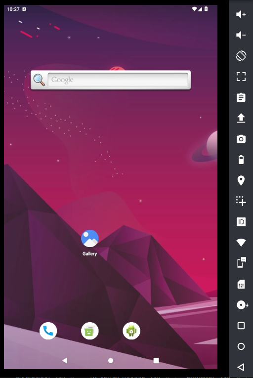

# Genymotion device web renderer


<a href="./doc/assets/screenshot.png" target="_blank">
  
</a>

This repository contains the Genymotion device web renderer JavaScript SDK.
It provides an easy way to integrate **Genymotion devices** running in the cloud into any web application. You will be able to display an emulator screen and interact with the device.

### 🚀 Engineered for Power

-   **compatibility** (vanilla JavaScript, no external framework used)
-   **performance** (30fps or more)
-   **quality** (Up to 1920×1080)
-   **low latency**

For more information about Genymotion devices, please visit the [Genymotion website](https://www.genymotion.com).

## 📜 Table of contents

1. 📋 [Requirements](#📋-requirements)
2. 📦 [Installation](#📦-installation)
    1. 📥 [Install via NPM / Yarn](#📥-install-via-npm--yarn)
    2. 🌐 [Install via a CDN](#🌐-install-via-a-cdn)
3. ⚡ [Quick Start Guide](#⚡-quick-start-guide)
4. 🎨 [Style and CSS](#🎨-style-and-css)
5. 📘 [API Documentation](#📘-api-documentation)
    1. 📡 [VM Communication](#📡-vm_communication)
    2. 🛠️ [utils](#🛠️-utils)
    3. 🎮 [keyMapping](#🎮-keyMapping)
    4. 🔊 [media](#🔊-media)
    5. 🎥 [video](#🎥-video)
6. ⚙️ [Features & Instance Options](#⚙️-features--instance-options)
    1. 🖥️ [Instance Options](#🖥️-instance-options)
    2. 🔌 [Plugin Options](#🔌-plugin-options)
7. ❓ [FAQ](#❓-faq)
8. 🤝 [Contributing](#🤝-contributing)

## 📋 Requirements

A Modern, WebRTC compatible, Web browser:

-   Google Chrome 85+
-   Mozilla Firefox 78+
-   Opera 70+
-   Microsoft Edge 20.10240+
-   Safari 11+

## 📦 Installation

### 📥 Install via NPM / Yarn

Using yarn:

```bash
yarn add @genymotion/device-web-player
```

Using npm:

```bash
npm install @genymotion/device-web-player
```

Package import (commonJS):

```js
const {DeviceRendererFactory} = require('genymotion/device-web-player');
```

```html
<style lang="scss">
    @import 'genymotion-device-web-renderer/dist/css/device-renderer.min.css';
</style>
```

### 🌐 Install via a CDN

```html
<link
    rel="stylesheet"
    href="https://cdn.jsdelivr.net/npm/@genymotion/device-web-player@4.1.5/dist/css/device-renderer.min.css"
/>
<script src="https://cdn.jsdelivr.net/npm/@genymotion/device-web-player@4.1.5/dist/js/device-renderer.min.js"></script>
```

## ⚡ Quick Start Guide

Use `DeviceRendererFactory` to instantiate one or more device renderers.
All you need is an HTML element to use as a container. See example below.
To find your instance WebRTC address, use the [SaaS API](https://developer.genymotion.com/saas/#operation/getInstance)
or check the [PaaS documentation](https://docs.genymotion.com/paas/01_Requirements/), based on your device provider.

```html
<!-- OPTIONAL: Import google maps library with your API key to enable map positioning feature
<script src="https://maps.googleapis.com/maps/api/js?key=xxxxxxxxxxxxxxxxxxxxxxxx-yyyyyyyyyyyyyy"></script>
-->

<div id="genymotion"></div>

<script>
    // Instance address
    const webrtcAddress = 'wss://x.x.x.x';
    const container = document.getElementById('genymotion');

    // See "Features & options" section for more details about options
    const options = {
        token: 'i-XXXXXXXXXX', // token is the shared secret to connect to your VM
        fileUpload: false, // requires fileUploadUrl
    };

    // Device renderer instanciation
    const {DeviceRendererFactory} = window.genyDeviceWebPlayer;
    const deviceRendererFactory = new DeviceRendererFactory();
    const rendererAPI = deviceRendererFactory.setupRenderer(
        container, // the container element or element ID to use
        webrtcAddress, // the websocket address of your instance connector
        options, // options object to enable or disable features
    );

    // Disconnect the device renderer, closing any open data channels.
    window.addEventListener('beforeunload', function () {
        playerAPI.disconnect();
    });
</script>
```

## 🎨 Style and CSS

The player leverages CSS variables in Material Design mode to style the app, while remaining fully customizable by overriding the CSS classes.

#### CSS variables available with their default presets:

Colors

    --gm-primary-color: rgba(230, 25, 94, 1);
    --gm-on-primary-color: rgba(255, 255, 255, 1);
    --gm-primary-variant-color: rgba(230, 25, 94, 0.2);
    --gm-on-primary-variant-color: rgba(230, 25, 94, 1);
    --gm-secondary-color: #292929;
    --gm-on-secondary-color: #ffffff;
    --gm-secondary-variant-color: #212121;
    --gm-on-secondary-variant-color: #ffffff;
    --gm-tertiary-color: #c4c4c44d;
    --gm-on-tertiary-color: #ffffff;
    --gm-tertiary-variant-color: #c4c4c4;
    --gm-on-tertiary-variant-color: #1A1A1A;
    --gm-background-color: #1A1A1A;
    --gm-on-background-color: #ffffff;
    --gm-surface-color: #292929;
    --gm-on-surface-color: #ffffff;
    --gm-error-color: rgba(255, 17, 17, 1);
    --gm-background-error-color: rgba(255, 17, 17, 0.1);
    --gm-success-color: rgba(17, 185, 32, 1);
    --gm-background-success-color: rgba(17, 185, 32, 0.1);
    --gm-warning-color: rgba(255, 204, 0, 1);
    --gm-background-warning-color:  rgba(255, 204, 0, 0.1);
    --gm-gradiant-1: linear-gradient(142.33deg, #E6195E 4.58%, #2B41EA 122.31%);
    --gm-on-gradiant-1: rgba(255, 255, 255, 1);
    --gm-gradiant-2: linear-gradient(275.69deg, #E6195E 10.31%, #2B41EA 136.09%);
    --gm-on-gradiant-2: rgba(255, 255, 255, 1);

## 📘 API Documentation

The Player API provides functionality for managing plugin options and websocket communication. These operations are handled through the API (categorized) object returned by the `setupRenderer` function.

### 📡 `VM_communication`

#### `disconnect`

**Description**: Disconnects the player from the virtual machine (VM) and cleans up the memory listeners.

#### `addEventListener`

**Description**: Registers a listener for messages emitted from the VM.

-   **Parameters**:

    -   `event` (string): The name of the event to listen for (e.g., 'fingerprint', 'gps').
    -   `callback` (function): The function to call when the event is emitted. The VM's message will be passed to the callback.

-   **Example usage**:
    ```js
    addEventListener('fingerprint', (msg) => {
        console.log(msg);
    });
    ```

#### `sendData`

**Description**: Sends messages to the VM.

-   **Parameters**:

    -   `data` (object): An object containing the channel and messages to be sent.
        -   `channel` (string): The channel to send the messages to.
        -   `messages` (array\<string\>): An array of messages to send.

-   **Example usage**:
    ```js
    sendData({
        channel: 'battery',
        messages: ['set state level 10', 'set state status true'],
    });
    ```

### 🛠️ `utils`

#### `getRegisteredFunctions`

**Description**: Returns a list of available functions with optional descriptions.

### 🎮 `keyMapping`

#### `setConfig`

**Description**: Provides configuration for keymapping. The configuration is passed as an object containing key-value pairs

-   **Example configuration**:
    ```js
    {
        dPad: [{
            keys: [
                {
                    key: 'w',
                    effect: { initialX: 20, initialY: 80, distanceX: 0, distanceY: -10 },
                    name: 'up',
                    description: 'move up',
                },
                {
                    key: 's',
                    effect: { initialX: 20, initialY: 80, distanceX: 0, distanceY: 10 },
                    name: 'down',
                    description: 'move down',
                },
                // ... other keys
            ],
            name: 'character movement',
            description: 'Left joystick used to move the character',
        }],
        tap: [{
            key: 'p',
            effect: { initialX: 50, initialY: 50 },
            name: 'Fire',
        }],
        swipe: [{
            key: 'u',
            effect: { initialX: 50, initialY: 50, distanceX: -10, distanceY: 0, description: 'swipe left' },
            name: 'Left dodge',
            description: 'Dodge on the left',
        }]
    }
    ```

#### `activeKeyMappingDebug`

**Description**: Helper to create the config mapping.

-   **Parameters**:
    -   `isTraceActivate` (boolean): If true, it prints the x and y coordinates over the video stream for all clicks.
    -   `isGridActivate` (boolean): If true, displays a grid over the video stream. Both rows and columns have a size of 10%.

#### `enable`

**Description**: Enable or disable keymapping.

-   **Parameters**:
    -   `isActive` (boolean, optional): Enable or disable keymapping. Default is false.

### 🔊 `media`

#### `mute`

**Description**: Mutes the player’s audio.

#### `unmute`

**Description**: Unmutes the player’s audio.

### 🎥 `video`

#### `fullscreen`

**Description**: Enables fullscreen mode, but must be called from a user action in compliance with browser security rules.

## ⚙️ Features & Instance options

A device renderer instance can be configured using the `options` argument (object). Possible configuration key / value are described below.

### 🖥️ Instance options

#### `token`

-   **Type:** `String`
-   **Default:** `undefined`
-   **Compatibility:** `PaaS`, `SaaS`
-   **Details:**
    Instance access token, the shared secret used to connect to the device. For Genymotion PaaS devices, the token is the instance id (more information can be find [here](https://docs.genymotion.com/paas/02_Getting_Started/)). For SaaS devices, you must generate the access token using the [login api](https://developer.genymotion.com/saas/#operation/login).

#### `toolbarOrder`

-   **Type:** `Array<string>`
-   **Default:** `[]`
-   **Special options**
    -   `separator`: to display a separator between icons
    -   `unordered`: displays all other plugin icons that are active but not explicitly specified in the `toolbarOrder`
-   **Example**:`[
'ButtonsEvents_ROTATE',
'separator',
'Battery',
'FingerPrint',
'separator',
'unordered',
'separator',
'ButtonsEvents_POWER']`
-   **Details:**
    The `toolbarOrder` option allows you to define the order in which plugin icons appear in the toolbar. Each string in the array corresponds to the unique identifier (id) of a button registered in the toolbar manager. The IDs of the plugins are provided below in the plugin option details.

#### `showPhoneBorder`

-   **Type:** `Boolean`
-   **Default:** `false`
-   **Details:**
    Adds a mobile-style frame around the video to mimic the appearance of a smartphone screen.

### `toolbarPosition`

-   **Type:** `String`
-   **Default:** `right`
-   **Details:**
    Position of the toolbar
-   **Available options:**
-   `"left"` → Toolbar appears on the left side.
-   `"right"` → Toolbar appears on the right side.

#### `connectionFailedURL`

-   **Type:** `String`
-   **Default:** `undefined`
-   **Compatibility:** `SaaS`, `PaaS`
-   **Details:**
    Redirection page in case of a connection error.

#### `giveFeedbackLink`

-   **Type:** `String`
-   **Default:** `giveFeedbackLink`
-   **Compatibility:** `SaaS`, `PaaS`
-   **Details:**
    Set the url for the feedback page.

#### 🔧 Advanced Options

#### `i18n`

-   **Type:** `Object`
-   **Default:** `{}`
-   **Compatibility:** `PaaS`, `SaaS`
-   **Details:**
    Alternative translation for the renderer UI.

#### `stun`

-   **Type:** `Object`
-   **Default:** `{}`
-   **Compatibility:** `PaaS`, `SaaS`
-   **Details:**
    WebRTC STUN servers configuration. Format:

```js
{
    urls: [
        'stun:stun-server1.org:80',
        'stun:stun-server2.org:443',
        ...
    ],
}
```

#### `turn`

-   **Type:** `Object`
-   **Default:** `{}`
-   **Compatibility:** `PaaS`, `SaaS`
-   **Details:**
    WebRTC TURN servers configuration. Format:

```js
{
    urls: [],
    username: "myUsername",
    credential: "myPassword",
    default: false  // Whether or not we should use the TURN servers by default. Default: false.
}
```

### 🔌 Plugin Options

#### battery 

-   **Type:** `Boolean`
-   **Default:** `true`
-   **Toolbar name:** `Battery`
-   **Compatibility:** `PaaS`, `SaaS`
-   **Details:**
    Enable or disable the battery widget. This widget can be used to set the battery level and state of the Android virtual device.

#### baseband 

-   **Type:** `Boolean`
-   **Default:** `false`
-   **Toolbar name:** `Baseband`
-   **Compatibility:** `PaaS`, `SaaS`
-   **Details:**
    Enable or disable the baseband (MMC/MNC) widget.

#### biometrics 

-   **Type:** `Boolean`
-   **Default:** `true`
-   **Toolbar name:** `FingerPrint`
-   **Compatibility:** `SaaS`, `PaaS`
-   **Details:**
    Enable or disable the fingerprint widget. This widget can be used to manage fingerprint reading requests. Available for Android 9 and above.

#### camera 

-   **Type:** `Boolean`
-   **Default:** `true`
-   **Toolbar name:** `Camera`
-   **Compatibility:** `PaaS`, `SaaS`
-   **Details:**
    Enable or disable the camera widget. This widget can be used to forward local webcam video to the Android virtual device. By default, if the `microphone` property is also true, then the default audio input will be used as well.

#### clipboard 

-   **Type:** `Boolean`
-   **Default:** `true`
-   **Toolbar name:** `Clipboard`
-   **Compatibility:** `PaaS`, `SaaS`
-   **Details:**
    Enable or disable the clipboard widget. This widget allows you to share clipboard content between the local machine and the Android virtual device, enabling seamless copy-paste functionality in both directions.

#### capture 

-   **Type:** `Boolean`
-   **Default:** `true`
-   **Toolbar name:** `Screencast`
-   **Compatibility:** `PaaS`, `SaaS`
-   **Details:**
    Enable or disable the capture widget. This widget can be used to capture the screen of the Android virtual device (screenshot or screencast).

#### diskIO 

-   **Type:** `Boolean`
-   **Default:** `true`
-   **Toolbar name:** `IOThrottling`
-   **Compatibility:** `PaaS`, `SaaS`
-   **Details:**
    Enable or disable the diskIO widget. This widget can be used to modify Disk IO (throttling) of the Android virtual device.

#### fileUpload 

-   **Type:** `Boolean`
-   **Default:** `true`
-   **Toolbar name:** `FileUpload`
-   **Compatibility:** `PaaS`, `SaaS`
-   **Details:**
    Enable or disable the fileUpload widget and drag & drop. This widget can be used to forward local file to the Android virtual device. When dragging & dropping APK or ZIP files, it will install them.

#### `fileUploadUrl`

-   **Type:** `String`
-   **Default:** `undefined`
-   **Compatibility:** `PaaS`, `SaaS`
-   **Details:**
    Set the file upload URL, required if `fileUpload` is set to `true`.

#### fullscreen 

-   **Type:** `Boolean`
-   **Default:** `true`
-   **Toolbar name:** `Fullscreen`
-   **Compatibility:** `PaaS`, `SaaS`
-   **Details:**
    Enable or disable the fullscreen widget. This widget can be used to make the renderer go fullscreen.

#### gamepad 

-   **Type:** `Boolean`
-   **Default:** `true`
-   **Toolbar name:** `Gamepad`
-   **Compatibility:** `SaaS`, `PaaS`
-   **Details:**
    Enable or disable gamepad support & widget.

#### gps 

-   **Type:** `Boolean`
-   **Default:** `true`
-   **Toolbar name:** `GPS`
-   **Compatibility:** `PaaS`, `SaaS`
-   **Details:**
    Enable or disable the GPS widget. This widget can be used to set the GPS location of the Android virtual device. If you want to use a visual map instead of GPS coordinates to set the location, you must import the Google Maps library with your API key.

```html
<!-- OPTIONAL: Import google maps library with your API key to enable map positioning feature -->
<script src="https://maps.googleapis.com/maps/api/js?key=xxxxxxxxxxxxxxxxxxxxxxxx-yyyyyyyyyyyyyy"></script>
```

#### `gpsSpeedSupport`

-   **Type:** `Boolean`
-   **Default:** `false`
-   **Compatibility:** `PaaS`, `SaaS`
-   **Details:**
    Enable or disable GPS speed support.

#### identifiers 

-   **Type:** `Boolean`
-   **Default:** `true`
-   **Toolbar name:** `Identifiers`
-   **Compatibility:** `PaaS`, `SaaS`
-   **Details:**
    Enable or disable the identifiers widget. This widget can be used to set the identifiers (Android ID / IMEI) of the Android virtual device.

#### `keyboard`

-   **Type:** `Boolean`
-   **Default:** `true`
-   **Compatibility:** `PaaS`, `SaaS`
-   **Details:**
    Enable or disable the keyboard widget. This widget can be used to transmit keyboard keystrokes to the Android virtual device.

#### keyboardMapping 

-   **Type:** `Boolean`
-   **Default:** `true`
-   **Toolbar name:** `KeyboardMapping`
-   **Compatibility:** `PaaS`, `SaaS`
-   **Details:**
    Enable or disable the keyboard mapping. This widget can be used to map keys with commands (e.g., tap, swipe-left, tilt, etc.).

#### `microphone`

-   **Type:** `Boolean`
-   **Default:** `false`
-   **Compatibility:** `PaaS`
-   **Details:**
    Enable or disable microphone injection. This can be used to forward the local microphone (or webcam audio) to the Android virtual device.

#### `mouse`

-   **Type:** `Boolean`
-   **Default:** `true`
-   **Compatibility:** `PaaS`, `SaaS`
-   **Details:**
    Enable or disable the mouse events. If you want to disable all VM interactions, also disable `touch` and `keyboard`.

#### navbar 

-   **Type:** `Boolean`
-   **Default:** `true`
-   **Toolbar name:** `ButtonsEvents_RECENT_APP`, `ButtonsEvents_HOME`, `ButtonsEvents_BACK`
-   **Compatibility:** `PaaS`, `SaaS`
-   **Details:**
    Enable or disable the navbar widgets. This widget can be used to navigate in the Android virtual device like when using hardware buttons.

#### network 

-   **Type:** `Boolean`
-   **Default:** `true`
-   **Toolbar name:** `Network`
-   **Compatibility:** `PaaS`, `SaaS`
-   **Details:**
    Enable or disable the network widget. This widget can be used to enable or disable the Wi-Fi or mobile network, and to set network throttling (mobile network type and signal strength) of the Android virtual device.

#### phone 

-   **Type:** `Boolean`
-   **Default:** `true`
-   **Toolbar name:** `Phone`
-   **Compatibility:** `PaaS`, `SaaS`
-   **Details:**
    Enable or disable the phone widget. This widget can be used to send SMS's or make phone calls to the Android virtual device.

#### power 

-   **Type:** `Boolean`
-   **Default:** `true`
-   **Toolbar name:** `ButtonsEvents_POWER`
-   **Compatibility:** `PaaS`, `SaaS`
-   **Details:**
    Enable or disable the power widget. This widget can be used to power off or reboot the Android virtual device.

#### rotation 

-   **Type:** `Boolean`
-   **Default:** `true`
-   **Toolbar name:** `ButtonsEvents_ROTATE`
-   **Compatibility:** `PaaS`, `SaaS`
-   **Details:**
    Enable or disable the rotation widget. This widget can be used to rotate the Android virtual device.

#### streamResolution 

-   **Type:** `Boolean`
-   **Default:** `true`
-   **Toolbar name:** `StreamResolution`
-   **Compatibility:** `SaaS`
-   **Details:**
    Enable or disable the video stream quality widget.

#### streamBitrate 

-   **Type:** `Boolean`
-   **Default:** `false`
-   **Toolbar name:** `StreamBitrate`
-   **Compatibility:** `SaaS`
-   **Details:**
    Enable or disable the stream bitrate widget.

#### volume  

-   **Type:** `Boolean`
-   **Default:** `true`
-   **Toolbar name:** `ButtonsEvents_VOLUME_UP`, `ButtonsEvents_VOLUME_DOWN`
-   **Compatibility:** `PaaS`, `SaaS`
-   **Details:**
    Enable or disable the volume widget. This widget can be used to increase or decrease the volume of the Android virtual device.

#### `wifi`

-   **Type:** `Boolean`
-   **Default:** `true`
-   **Compatibility:** `PaaS`, `SaaS`
-   **Details:**
    Enable or disable the Wi-Fi widget. This widget can be used to enable or disable the Wi-Fi network on the Android virtual device.

## ❓ FAQ

### How do I get an API key?

Sign up on [Genymotion SaaS](https://cloud.geny.io/signin) and generate an API key from the dashboard.

### Can I use this SDK with on-premise deployments?

No, this SDK is designed for Genymotion's SaaS platform only.

## 🤝 Contributing

Read through our [contributing guidelines](https://github.com/Genymobile/genymotion-device-web-player/blob/main/CONTRIBUTING.md) to learn about our submission process, coding rules and more.
